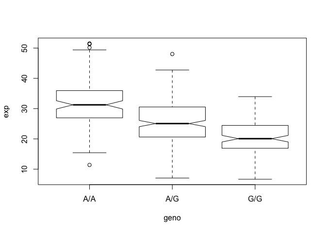

Class 15: Genomics I
================

## Read sample genotypes data from ENSEMBLE

We downloaded genotype data from ENSEMBLE on the MXL Mexican Ancestry in
Los Angeles, California dataset.

What proportion of this data are G/G
etc?

``` r
mxl <- read.csv("373531-SampleGenotypes-Homo_sapiens_Variation_Sample_rs8067378.csv")

head(mxl)
```

    ##   Sample..Male.Female.Unknown. Genotype..forward.strand. Population.s. Father
    ## 1                  NA19648 (F)                       A|A ALL, AMR, MXL      -
    ## 2                  NA19649 (M)                       G|G ALL, AMR, MXL      -
    ## 3                  NA19651 (F)                       A|A ALL, AMR, MXL      -
    ## 4                  NA19652 (M)                       G|G ALL, AMR, MXL      -
    ## 5                  NA19654 (F)                       G|G ALL, AMR, MXL      -
    ## 6                  NA19655 (M)                       A|G ALL, AMR, MXL      -
    ##   Mother
    ## 1      -
    ## 2      -
    ## 3      -
    ## 4      -
    ## 5      -
    ## 6      -

We want to look at the second column that contains the genotype
information

``` r
table( mxl$Genotype..forward.strand. )
```

    ## 
    ## A|A A|G G|A G|G 
    ##  22  21  12   9

## RNA-Seq result analysis for different genotypes of this SNP

``` r
expr <- read.table("rs8067378_ENSG00000172057.6.txt")
head(expr)
```

    ##    sample geno      exp
    ## 1 HG00367  A/G 28.96038
    ## 2 NA20768  A/G 20.24449
    ## 3 HG00361  A/A 31.32628
    ## 4 HG00135  A/A 34.11169
    ## 5 NA18870  G/G 18.25141
    ## 6 NA11993  A/A 32.89721

``` r
summary( expr[ expr$geno == "G/G", ]$exp )
```

    ##    Min. 1st Qu.  Median    Mean 3rd Qu.    Max. 
    ##   6.675  16.903  20.074  20.594  24.457  33.956

``` r
summary( expr[ expr$geno == "A/G", ]$exp )
```

    ##    Min. 1st Qu.  Median    Mean 3rd Qu.    Max. 
    ##   7.075  20.626  25.065  25.397  30.552  48.034

``` r
summary( expr[ expr$geno == "A/A", ]$exp )
```

    ##    Min. 1st Qu.  Median    Mean 3rd Qu.    Max. 
    ##   11.40   27.02   31.25   31.82   35.92   51.52

## Try a boxplot

We will use the `boxplot()` function and the input data will be
**expr**. How do we draw a useful plot?

``` r
boxplot(exp ~ geno , data=expr, notch=TRUE)
```

<!-- -->

How many samples are we looking at here?

``` r
nrow(expr)
```

    ## [1] 462

``` r
hist( expr[ expr$geno == "G/G", ]$exp, breaks=20 )
```

<!-- -->

``` r
x <- 1:10
x[ x > 5 ]
```

    ## [1]  6  7  8  9 10

## Try dplyr approch

``` r
library(dplyr)
```

    ## 
    ## Attaching package: 'dplyr'

    ## The following objects are masked from 'package:stats':
    ## 
    ##     filter, lag

    ## The following objects are masked from 'package:base':
    ## 
    ##     intersect, setdiff, setequal, union

``` r
expr %>%
  group_by(geno) %>%
  summarise(count_by_genotype=n(),
            mean_exp = mean(exp),
            sd_exp = sd(exp))
```

    ## # A tibble: 3 x 4
    ##   geno  count_by_genotype mean_exp sd_exp
    ##   <fct>             <int>    <dbl>  <dbl>
    ## 1 A/A                 108     31.8   7.91
    ## 2 A/G                 233     25.4   6.99
    ## 3 G/G                 121     20.6   5.67

And a ggplot

``` r
library(ggplot2)

ggplot(expr, aes(geno, exp, fill=geno)) +
  geom_boxplot(notch = TRUE, outlier.alpha=0.5) +
  labs(x="Genotype", y="Expression",
       title="Expresion of by genotype for rs8067378",
       subtitle = "See class15 workbook",
       caption="ENSG00000172057") +
  theme(legend.position = "none") 
```

<!-- -->

And a formated table

``` r
expr %>%
  group_by(geno) %>%
  summarise(number_samples=n(),
            mean_exp = round(mean(exp),2),
            sd_exp = round(sd(exp),2)) %>%
  kableExtra::kable()
```

<table>

<thead>

<tr>

<th style="text-align:left;">

geno

</th>

<th style="text-align:right;">

number\_samples

</th>

<th style="text-align:right;">

mean\_exp

</th>

<th style="text-align:right;">

sd\_exp

</th>

</tr>

</thead>

<tbody>

<tr>

<td style="text-align:left;">

A/A

</td>

<td style="text-align:right;">

108

</td>

<td style="text-align:right;">

31.82

</td>

<td style="text-align:right;">

7.91

</td>

</tr>

<tr>

<td style="text-align:left;">

A/G

</td>

<td style="text-align:right;">

233

</td>

<td style="text-align:right;">

25.40

</td>

<td style="text-align:right;">

6.99

</td>

</tr>

<tr>

<td style="text-align:left;">

G/G

</td>

<td style="text-align:right;">

121

</td>

<td style="text-align:right;">

20.59

</td>

<td style="text-align:right;">

5.67

</td>

</tr>

</tbody>

</table>
