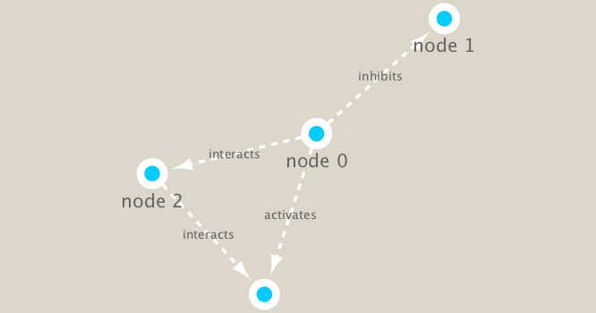

```{r setup, include=FALSE}
knitr::opts_chunk$set(echo = TRUE)
```

# TARA ocean data analysis

In this analysis we are using a Tara Ocean data and we have data from the bacterial dataset (Sunagawa et al. 2015) and also from the viral dataset (Brum et al. 2015). They have been examined in Lima-Mendez et al. (2015) and we have used the original relative abundances to visualize the data. Data were retrieved from: http://www.raeslab.org/companion/ocean-interactome.html


## Setup the R packages we need

I run the install in my R console NOT in my rmarkdown document
```{r eval=FALSE}
BiocManager::install("RCy3")
install.packages("igraph")

```


```{r}
library(igraph)
library(RCy3)
```

Can we talk to cytoscape from R

```{r}
cytoscapePing()
```

We can test things further by making a little sample network and sending it to cytoscape

```{r}
g <- makeSimpleIgraph()
createNetworkFromIgraph(g,"myGraph")
```

Update the style of the network displayed in cytoscape

```{r}
setVisualStyle("Marquee")

```

Lets save an image from cytoscape and include it in this document

```{r}
fig <- exportImage(filename="demo_marquee", type="png", height=350)


```

```{r}
plot(g)
```


Read our input data for this session

```{r}
prok_vir_cor <- read.delim("virus_prok_cor_abundant.tsv", stringsAsFactors = FALSE)

## Have a peak at the first 6 rows
head(prok_vir_cor)
```

```{r}
g <- graph.data.frame(prok_vir_cor, directed = FALSE)
```

```{r}
plot(g)
```

This is a hot mess! lets turn off the labels and make nodes/vertex  smaller
```{r}
plot(g, vertex.size=3, vertex.label=NA)

```

Send to cytoscape
```{r}
createNetworkFromIgraph(g,"newIgraph")

```

## Network community detection

Community structure detection algorithms try to find dense sub-graphs within larger network graphs (i.e. clusters of well connected nodes that are densely connected themselves but sparsely connected to other nodes outside the cluster) . Here we use the classic Girvan & Newman betweenness clustering method. The igraph package has lots of different community detection algorithms (i.e. different methods for finding communities).


```{r}
cb <- cluster_edge_betweenness(g)

```

```{r}
plot(cb, y=g, vertex.label=NA,  vertex.size=3)

```

## Centrality analysis
Centrality gives an estimation on how important a node or edge is for the connectivity (or the information flow) of a network. It is a particularly useful parameter in signaling networks and it is often used when trying to find drug targets for example.

Centrality analysis often aims to answer the following question: Which nodes are the most important and why?

One centrality method that you can often find in publications is the Google PageRank score. For the explanation of the PageRank algorithm, see the following webpage: http://infolab.stanford.edu/~backrub/google.html


```{r}
pr <- page_rank(g)

```

```{r}
v.size <- BBmisc::normalize(pr$vector, range=c(2,20), method="range")
plot(g, vertex.size=v.size, vertex.label=NA)
```

